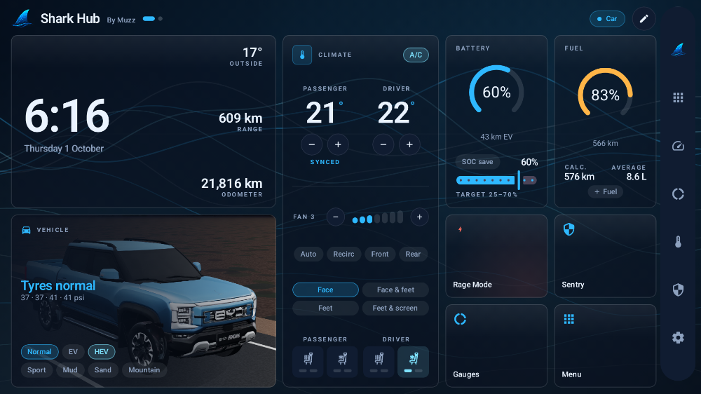
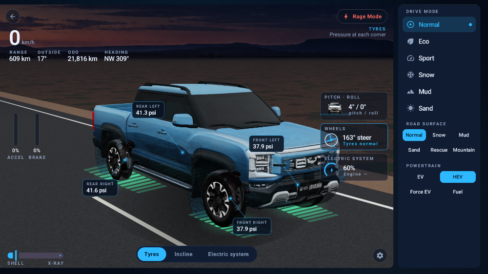
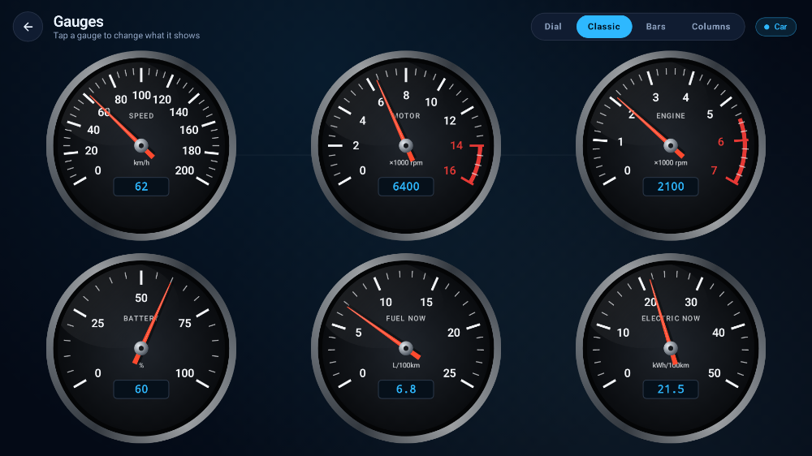
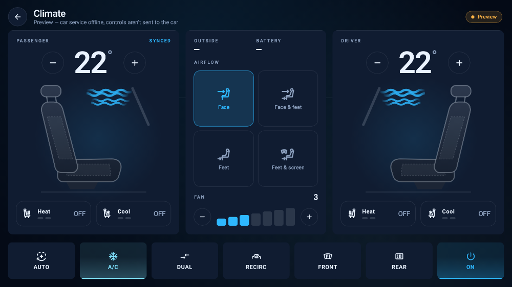
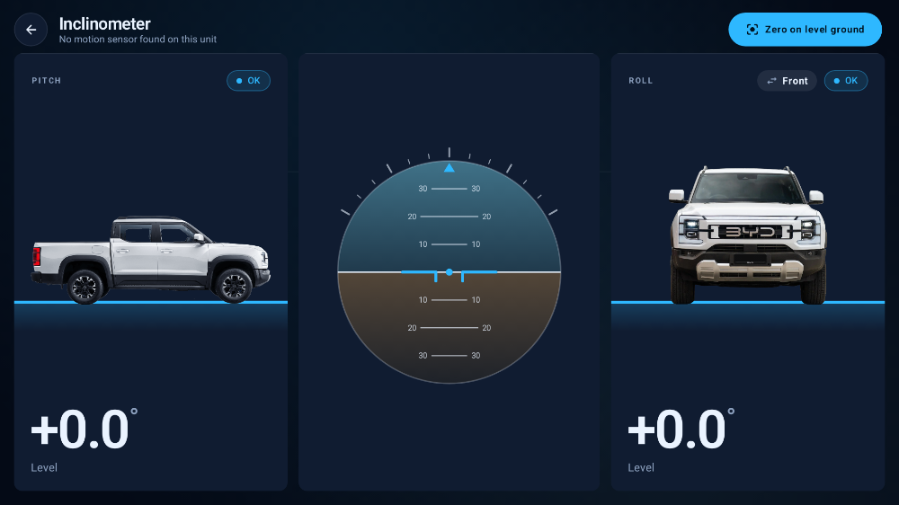
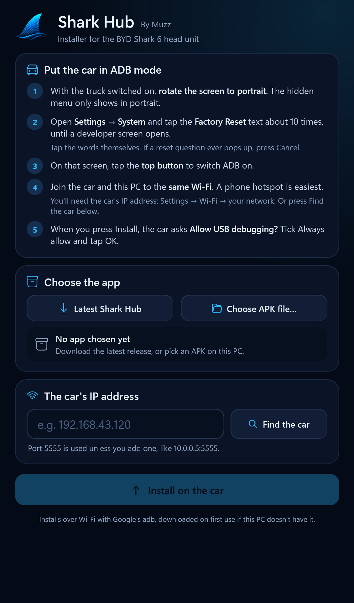
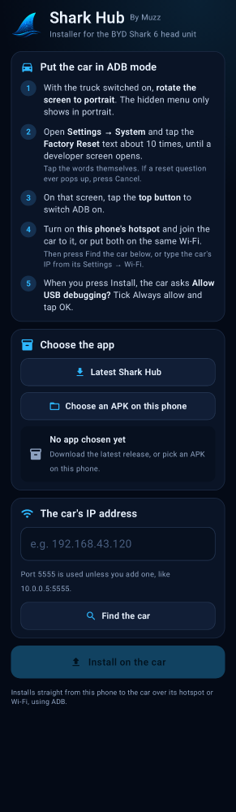

# Shark Hub

A custom dashboard for the **BYD Shark 6** head unit, by Muzz. It installs alongside the factory
software and gives you cleaner, themeable screens for climate, driving data, off-road angles, fuel
tracking and more, laid out for the car's big landscape screen.



> [!IMPORTANT]
> **Unofficial.** Shark Hub is an owner's hobby project. It isn't made, endorsed or supported by BYD.
> It talks to the car through the same services the factory apps use and never gets around the
> car's own safety limits, which are enforced below Android. You install it at your own risk. Don't
> fiddle with it while driving.

## What it does

- **Dashboard.** A page of cards (clock and odometer, climate, battery, fuel, vehicle modes and
  shortcuts), a second page with the truck, and a shortcut rail down the right. Layouts, backdrops
  and the rail are chosen in Options.
- **Vehicle overview.** The truck drawn live, with wheels that turn with road speed, a shell to
  x-ray slider and callouts for tyres, incline and energy. Pedal bars and small see-through cards
  for pitch and roll, steering and compass float over it, next to the drive modes.
- **Climate.** Dual zone, heated and ventilated seats, airflow, fan, Auto, A/C, recirculation and
  defrost. Hold and swipe on any fan or temperature control to change it.
- **Gauges.** Six gauges; tap one to choose what it shows from 25 readings, such as speed, motor
  and engine rpm, fuel and energy use, battery, coolant and tyres. Four looks: Dial, Classic,
  Bars and Columns.
- **Inclinometer.** Pitch and roll drawn on real photos of the Shark from the side, front or rear.
  Zero it once on level ground.
- **Fuel log.** Enter litres on a small numpad and the odometer fills itself in. The card shows
  your average over the last three fills and a calculated range. It can ask for the litres by
  itself when the fuel gauge jumps after a fill.
- **Vehicle controls.** Drive modes, Normal / EV / HEV, terrain modes (Sport, Mud, Sand,
  Mountain), SOC save with a target, cruise and driver-assist settings, lights and quick toggles.
  Anything risky asks before it changes.
- **Themes and styles.** Five colour themes (Deep Sea, VN Mint, Slate Blue, Amber HUD, Daylight)
  and three styles (Glass, Infotainment, Glass HUD).
- **Sideload and updates.** Install APKs on the car over Wi-Fi from a phone or PC, and update Shark
  Hub itself from this repo's releases.
- **Service Probe.** Lists the car services and methods your firmware offers, exported as JSON over
  Wi-Fi. That's how new car functions get mapped.
- **Bluetooth helper.** Scan, classify and pair mice, keyboards and gamepads. See the caveat below.

| | |
|---|---|
|  |  |
|  |  |

The pictures are the app's own screen renders, with sample data.

## Status

Shark Hub has run on one car so far: an Australian right-hand-drive Shark 6 with the Desay SV head
unit (Android 11, build `SOC_260811_S`). An earlier build ran the home screen, live telemetry, the
Service Probe and the vehicle controls there. Climate is wired to BYD's own API, and a driver
temperature change was confirmed on the car.

Much of 0.2.0 hasn't been on a car yet. That covers the new dashboard, gauges, fuel log, SOC save,
terrain modes, the photo inclinometer and both installers. Expect rough edges, and please
[open an issue](https://github.com/Peacemaker105/SharkHub/issues) with what you find.

Other BYD models may partly work. The car API is found at runtime, and the Service Probe shows
what your firmware offers.

## Install

You need ADB on the car once, for the first install. After that Shark Hub updates itself.

### 1. Put the car in ADB mode

1. With the truck switched on, **rotate the screen to portrait**. The hidden menu only shows in
   portrait.
2. Open **Settings → System → Version** and tap the **Factory Reset** text about 10 times, until a
   developer screen opens. Tap the words themselves. If a reset question ever pops up, press
   **Cancel**.
3. On that screen, tap the **top button** to switch ADB on.
4. Put the car on the same Wi-Fi as your PC or phone. A phone hotspot is easiest.

### 2. Install with one of these

Everything is on the [latest release](https://github.com/Peacemaker105/SharkHub/releases/latest).

- **Windows PC: `SharkHubInstaller-Windows.exe`.** One portable file with nothing to install. It
  finds the car on your network, downloads the latest Shark Hub and installs it. It isn't
  code-signed, so Windows shows *Windows protected your PC*: press **More info → Run anyway**. A PC
  with Smart App Control switched on may refuse it, so use the phone installer or adb there.
- **Android phone: `SharkHubInstaller-Android.apk`.** Install it on your phone and allow installs
  from your browser or files app when asked. Turn on the phone's hotspot, join the car to it, then
  tap **Find the car** and **Install**.
- **adb, if you have it:**
  ```bash
  adb connect <car-ip>:5555
  adb install -r SharkHub-0.2.0.apk
  ```

The first time, the car asks **Allow USB debugging?** Tick *Always allow* and tap OK. Switch ADB
off again on the same developer screen when you're done.

<p>
  
  &nbsp;
  
</p>

### Updates

**Options → Updates** checks [`latest.json`](latest.json) in this repo and installs the newer APK
over the top, keeping your settings. You can also install a release APK from the **Sideload**
screen, or with `adb install -r`.

Every release is signed with the same key. A copy you build yourself is signed with *your* key, so
it can't update a release install, and vice versa. Uninstall first to switch, which clears Shark
Hub's settings.

## Build from source

You need Android Studio (Koala or newer) and **JDK 17 or 21** for Gradle. Newer Android Studio
releases bundle JDK 25, which Gradle 8.9 can't run on. Set *Settings → Build, Execution, Deployment
→ Build Tools → Gradle → Gradle JDK* to a 17 or 21 install.

```bash
./gradlew assembleDebug                # the app: app/build/outputs/apk/debug/app-debug.apk
./gradlew :installer:assembleDebug     # the phone installer
./gradlew recordPaparazziDebug         # render every screen to app/src/test/snapshots/images/
```

On Windows use `.\gradlew.bat`. The first sync downloads the Android Gradle Plugin and libraries.

The camera probe in `app/src/main/cpp` is switched on in `gradle.properties`. That means the first
build also downloads the Android NDK and CMake, about 1.5 GB. To skip it, add
`-Psharkhub.nativeCam=false` to the Gradle command. The Probe then reports the camera check as
unavailable.

The screen renders use Paparazzi, which draws each screen at head-unit size on your PC, with no
device needed. Look at them after any UI change.

The Windows installer builds with the C# compiler that ships with Windows, plus Python and Pillow
for its icon:

```powershell
powershell -ExecutionPolicy Bypass -File tools\installer\build.ps1
```

### Signing

Builds are signed with the key named in a `keystore.properties` file in the project root. The file
is gitignored:

```properties
storeFile=C:/Users/you/.android/sharkhub.jks
storePassword=…
keyAlias=sharkhub
keyPassword=…
```

Without it, Gradle's standard debug key is used. Android only installs an update that's signed with
the same key as the installed copy, whether it arrives by adb, Sideload or the updater.

## How it talks to the car

BYD's car functions live in `android.hardware.bydauto.*` device classes that the factory apps load.
Method names and value codes differ between models and firmware, so Shark Hub doesn't hard-code
one. `car/CarBackend.kt` finds the services at runtime and calls methods by name. `car/CarManager.kt`
and `car/VehicleControls.kt` hold the candidate names and codes for each function. To support a new
firmware you edit those lists, not the plumbing.

The **Service Probe** screen shows what your car offers:

- **Export over Wi-Fi** shows an address like `http://192.168.4.21:8090`. Open it on a phone on the
  same network and save `sharkhub-probe.json`. The report is built in memory and nothing is written
  to storage.
- **Dump to logcat** writes the same report to logcat, for use with adb:
  ```bash
  adb logcat -s SharkHubProbe:I
  ```

The report includes your car's VIN. Delete it before sharing the file with anyone.
[`probe/2026-09-28/`](probe/2026-09-28) holds a report from a Shark 6 for reference, with the VIN
removed.

Research notes on cameras and sentry mode are in [`docs/CAMERAS_SENTRY.md`](docs/CAMERAS_SENTRY.md).
The vehicle-control codes are in [`docs/VEHICLE_CONTROLS.md`](docs/VEHICLE_CONTROLS.md).

## Sideloading on the car

The **Sideload** screen, under Options, installs APKs through Android's own installer. It needs no
root, and you confirm each install once.

- **Wi-Fi upload.** Start the upload server and open the address it shows in a browser on your
  phone or PC, on the same Wi-Fi, then pick an APK. The server has no password, so only run it on a
  network you trust. It stops when you leave the screen.
- **Install from URL.** Paste a direct `.apk` link.
- **Local files.** Install `.apk` files already on the car's storage or a USB stick.

## Bluetooth mice, keyboards and gamepads

The Bluetooth screen scans, classifies and pairs devices, and pairing works. Whether the head unit
then accepts a paired device as live input is decided by the car's Android build, not by Shark Hub.
In practice gamepads usually work, keyboards often do, and mice are the most likely to be filtered.
Getting past that would need root or system access, which is out of scope.

## Project layout

```
app/                        the head-unit app (Kotlin, Jetpack Compose)
  src/main/java/com/chris/sharkhub/
    car/                    finding the car API, climate, telemetry and vehicle controls
    data/                   settings and the fuel log
    ota/  sideload/         self-update and APK installs
    sensors/                inclinometer
    ui/                     screens: dash/, overview/, gauges/, climate/, inclino/, theme/ …
  src/main/assets/car/      truck art for the overview and inclinometer
  src/test/                 Paparazzi screen renders and unit tests
installer/                  the Android phone installer
tools/installer/            the Windows installer (C# and WPF)
tools/model/                the 3D-model and photo pipeline behind the truck art
docs/                       research notes
probe/                      a Service Probe report from a Shark 6
latest.json                 the update manifest the app checks
```

`CLAUDE.md` has the detailed architecture notes and conventions, and `CHANGELOG.md` records what
each change did and how far it was tested.

## Credits

- The camera and sentry research follows the method documented by
  [OverDrive](https://github.com/yash-srivastava/Overdrive-release) by Yash Srivastava (MIT).
- The phone installer talks ADB with [dadb](https://github.com/mobile-dev-inc/dadb) by mobile.dev
  (Apache 2.0).
- Built with Jetpack Compose and OkHttp. The screen renders use Paparazzi.
  [`THIRD_PARTY_NOTICES.md`](THIRD_PARTY_NOTICES.md) lists the libraries and their licences.

## Imagery and trademarks

BYD, Shark and DiLink are trademarks of BYD. The truck pictures in the app are made from BYD's
press and configurator images and publicly available photos, with number plates removed. They're
used only to show the vehicle. If you hold the rights to one and want it removed, please open an
issue.

## Licence

The code is released under the [MIT licence](LICENSE). The licence doesn't cover the BYD-derived
imagery, which remains its owners' property.
